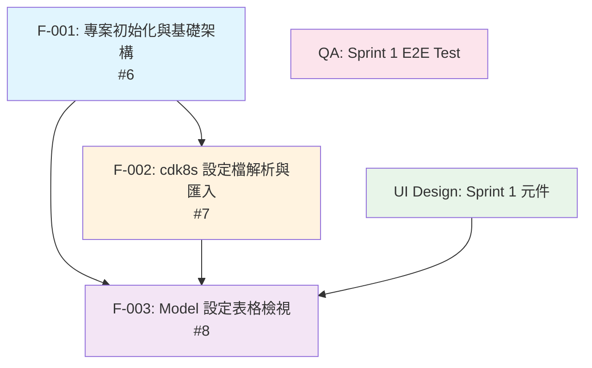

# Sprint 1 依賴圖譜

## 依賴關係



## 依賴說明

| Feature | 依賴 | 原因 |
|---------|------|------|
| F-001 專案初始化 | 無 | 基礎設施，無前置依賴 |
| F-002 cdk8s 解析 | F-001 | 需要 DB schema (Version, Environment, Edition, ModelComponent, ModelSetting tables) + API 框架 |
| F-003 設定表格檢視 | F-001, F-002 | 需要 DB schema + API 框架（F-001），且需要有資料才能顯示（F-002 匯入資料）|
| UI Design | 無 | 元件設計可先行，不依賴後端 |
| QA | 無（先行撰寫） | 可先根據 spec 撰寫 test script，待功能完成後執行 |

## 拓撲排序

### Wave 0（先行，可並行）
- **F-001: 專案初始化與基礎架構** (#6)
  - 無依賴，最先開始
  - 產出：Next.js 專案骨架、DB schema migration、Docker Compose、健康檢查 API
- **UI Design: Sprint 1 元件** (design issue)
  - 無依賴，可與 F-001 同時進行
  - 產出：設計系統 tokens、Table/Card/Filter 等元件規格
- **QA: Sprint 1 E2E Test** (qa issue)
  - 先根據 spec 撰寫 test scenarios 和 test script 骨架
  - 產出：E2E test 框架設定、test case 骨架

### Wave 1（F-001 完成後）
- **F-002: cdk8s 設定檔解析與匯入** (#7)
  - 依賴 F-001 的 DB schema 和 API 框架
  - 可在 F-001 merge 後立即開始
  - 產出：TypeScript 解析器、匯入 API、GitLab API 整合

### Wave 2（F-001 + F-002 完成後）
- **F-003: Model 設定表格檢視** (#8)
  - 依賴 F-001 的 API 框架 + F-002 匯入的資料
  - UI 元件參考 Design issue 的產出
  - 產出：版本清單頁面、設定表格頁面、篩選/排序/分頁功能

## 時間軸預估

```
Day 1-3  ┃ Wave 0: F-001 + UI Design + QA (test script)
         ┃ F-001: 專案骨架 + DB migration + Docker Compose
         ┃ Design: tokens + 元件規格
         ┃ QA: test framework + test case 骨架
         ┃
Day 4-6  ┃ Wave 1: F-002
         ┃ F-002: ts-morph 解析器 + GitLab API + 匯入 API
         ┃ QA: 補充 F-001 相關 test
         ┃
Day 7-10 ┃ Wave 2: F-003
         ┃ F-003: 版本清單 + 設定表格 + 篩選排序分頁
         ┃ QA: 執行完整 E2E test
         ┃
Day 11   ┃ Bug fix + 驗證
```

## 關鍵路徑

F-001 -> F-002 -> F-003

F-001 是 Sprint 1 的 critical path 起點。如果 F-001 延遲，整個 sprint 都會延遲。
建議 F-001 控制在 2-3 天內完成，並在完成 DB migration 後就讓 F-002 開始（不需要等 Docker Compose 和 health check 全部完善）。
